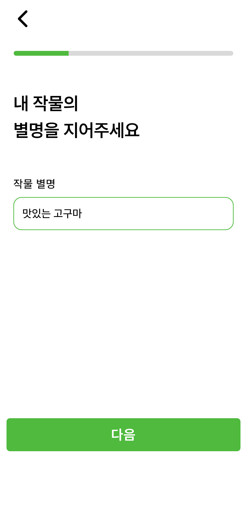
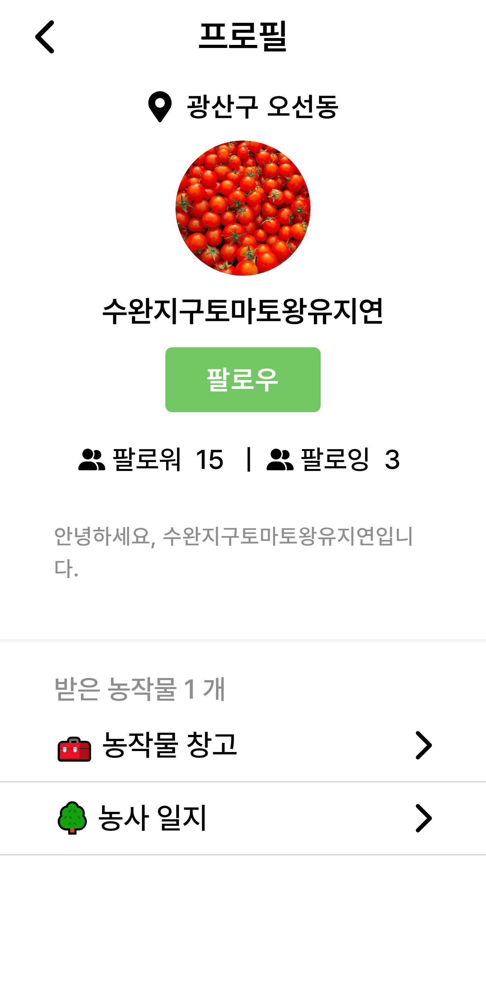
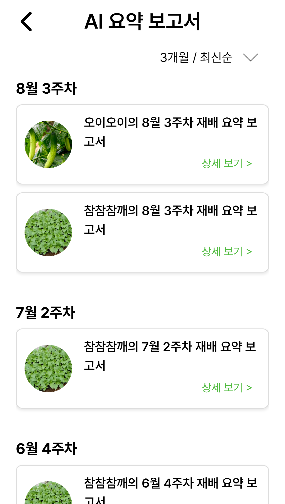
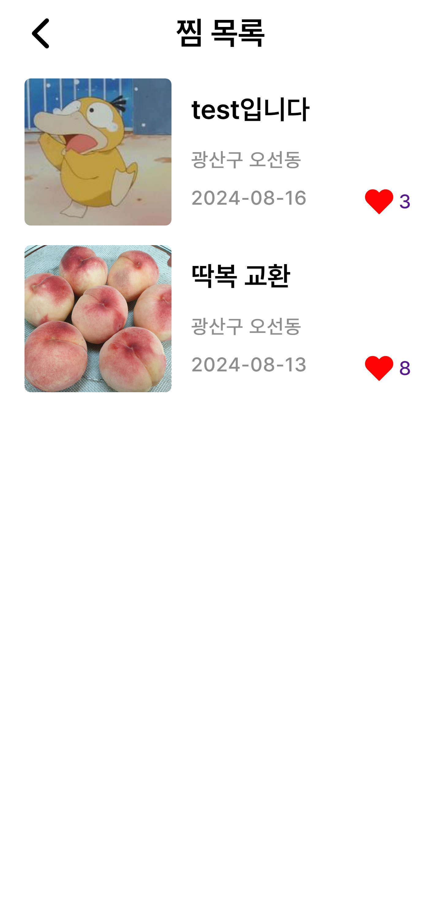
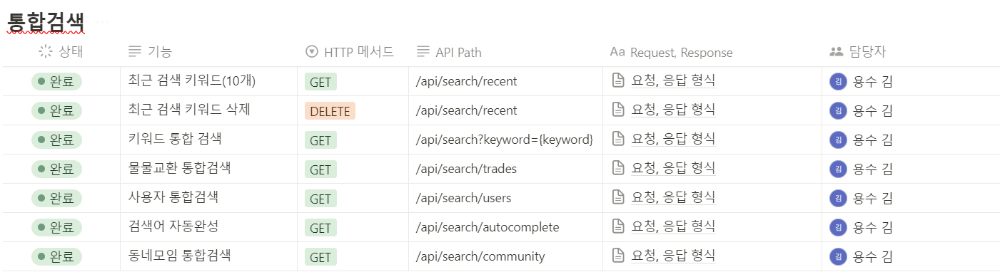

# 농작물 물물교환 서비스 - 밭터

  

 

## 프로젝트 정보

### 밭터 / BARTTER
밭터(BARTTER)는 밭으로 사용할 자리라는 뜻을 가진 우리말 단어 밭터, 그리고 물물교환을 뜻하는 영어 단어 Barter를  더해 만든 이름입니다.

 

### 소개

밭터는 동네에서 취미로 텃밭을 키우는 사람들끼리 모여 잉여 농작물을 물물교환하고, 농사일지를 통해 취미를 기록하며 이웃과 교류할 수 있는 소셜 네트워크 서비스입니다.

 

### 개발 기간: 2024년 7월 1일 ~ 2024년 8월 16일

 

## 배포 주소

서비스에 접근하려면 [여기](https://i11c210.p.ssafy.io/login/entrance)를 클릭하세요

 
 

## 팀 소개

### 백엔드

|                            김용수                             |                             김가람                             |                              김훈민                              |                                                                                                               
|:----------------------------------------------------------:|:-----------------------------------------------------------:|:-------------------------------------------------------------:| 
|  |  |  |
|           [@kys1651](https://github.com/kys1651)           |          [@garamgim](https://github.com/garamgim)           |         [@gnsals0904](https://github.com/gnsals0904)          |

### 프론트엔드

|                             김보현                              |                              김민영                               |                              유지연                              |                                                                                                               
|:------------------------------------------------------------:|:--------------------------------------------------------------:|:-------------------------------------------------------------:| 
|  |  |  |
|          [@BHyeonKim](https://github.com/BHyeonKim)          |         [@minyeong981](https://github.com/minyeong981)         |         [@jiyeoniing](https://github.com/jiyeoniing)          |

 
 

## 프로젝트 설명

밭터는 이웃간 농작물 물물교환과 텃밭 관리 기록을 목적으로 개발된 서비스입니다. 사용자는 자신이 기른 농작물의 사진을 공유하고, 이를 바탕으로 이웃과 물물교환을 할 수 있습니다. 또한 농사일지를 통해 농작물의 성장을
기록하고, 이웃과의 교류를 통해 지역 공동체를 형성할 수 있습니다.

 

## 기술 스택

### 프론트 엔드

 
 

 

### 백엔드

 
 
 
 

 

### 협업 관리 툴

 

 

### 기타

## 화면 구성

### 로그인 진입

  
  
  

 

### 메인 페이지

  
  

 

### 작물 등록하기

  
  

 

### 농작물 다이어리

  
  

 

### 농작물 다이어리 작성

 

### 물물교환

 

### 물물교환 상세 페이지

 

### 동네모임

 

### 프로필페이지

 

 

### 통합검색 

 

## API 명세서

### 회원 

 

### 농사일지 

 

### 나눔 / 물물교환 

 

### 동네모임 

 

### 통합검색 

 

### 주요 기능

---

- 농사 일지
    - 자신이 기르는 농작물의 프로필을 등록할 수 있습니다.
    - 해당 농작물 프로필을 참조하여 농사일지를 쓸 수 있습니다.
    - 각 농작물의 일주일치 농사일지를 토대로 AI를 통해 작업 상황을 분석하여 AI 요약 리포트를 제공합니다.
    - 전 주의 AI 요약 리포트를 기반으로 다음주에 할 일을 하루에 한 번씩 하루농사 알리미로 제공합니다.

 

- 물물 교환
    - 주고싶은 작물, 받고싶은 작물의 카테고리를 설정하여 물물교환을 손쉽게 할 수 있습니다.
    - 자신이 기르는 농작물의 프로필을 걸어서 물물교환 거래 시 추억도 함께 공유합니다.
    - 채팅을 통해 거래를 예약하고 완료할 수 있습니다.
    - 교환하거나 나눔 완료한 작물은 프로필의 농작문 컬렉션에서도 확인이 가능하여 나눔 받은 농작물의 추억까지 함께 보관하도록 하였습니다.

 

- 동네 모임
    - 순수한 정보공유나 친목만을 위한 자유 게시글 작성이 가능합니다.
    - 이때 유저 중심 좌표 5km 반경 내에 위치한 동네들의 게시글을 모아볼 수 있게 함으로써 지역 주민들과 활발히 교류할 수 있도록 하였습니다.

 

### 아키텍쳐

---

 
 

### ERD

---

